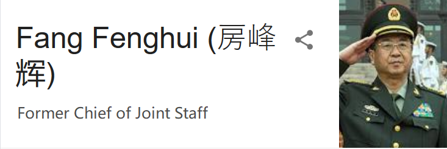
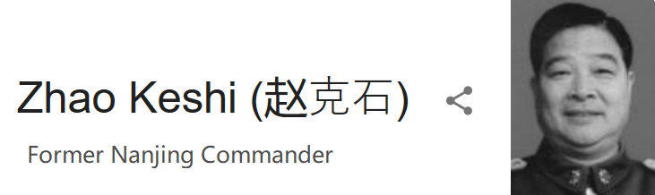

## A Look into the Chinese Media
I have a complicated relationship with the Chinese media. I've done work for CCTV in the past, and most of my translation clients have some sort of government ties.
Overall, I think that the daily news (新闻联播) that gets presented on CCTV is generally objective when it comes to international news. However, when it comes to domestic Chinese news, there can be more of an agenda. Having been a regular consumer of 新闻联播 before, I'm well aware of how the program will often shape a story to be very pro-China, and will often do fluff pieces on important figures.
But as a Data Scientist, I wanted to perform an exploration of this, and see if there were any recognizable trends in how many fluff pieces (for Xi Jinping in particular) are produced over time.

## The Dataset
The dataset I'm using was found on [Kaggle](https://www.kaggle.com/noxmoon/chinese-official-daily-news-since-2016), and features every written news article published for use on the 新闻联播 program between January 1, 2016 to October 15, 2018. It has 4 columns: Date, Tag, Headline, and Content.
The Tag column differentiates the rows in the dataset between "“详细全文” some relatively long news, "国内“ domestic short news, "国际“ international short news."

## Project Goals:
1. Explore whether there is any sort of trend in positive news/fluff pieces about Xi Jinping (especially surrounding the time of the constitutional change).
2. Come up with a way to predict whether a piece will be about Xi Jinping.
3. Create a filter for fluff pieces about Xi Jinping (sometimes it can feel like you are being bombarded by propaganda) (Future Work)

## Data Exploration and Code
To get started, here's a list of all the imports that were used in this project:

Most of these are fairly standard for NLP, but one package that some might be unfamiliar with is . Jieba is a popular tokenizer specifically for Chinese characters, and typically does a great job parsing which should be compound characters and which should not. It also allows you to add custom tokenization rules pretty easily, if something isn't parsing quite right.

And this is typically what the data looked like:

It had 20,738 rows with only 100 or so stories that repeated. Since these were all stories that did actually air, I decided to leave them in.

**Non-NLP Feature Engineering**

  Before getting to the NLP aspect of the project, I wanted to see if there was perhaps an increase in Xi Jinping-friendly stories surrounding times when there may typically be negative public sentiment about him (specifically in March, when he changed to constitution to remove presidential term limits). This required me to "manually" determine if each news story was about Xi, an arduous task with over 20,000 rows of data.
  
  So I counted the ratio of mentions of Xi Jinping (or Chairman Xi, Secretary Xi, etc.) to the character count of an article, getting the percentage he was mentioned, and cross-referenced articles with high "Xi counts" with whether or not he is mentioned in the title. 
  
 

  This was typically a good enough measure for whether an article was truly about Xi or not, which allowed me to tag it (for later use by NLP classifiers). I did do a manual count of about 2,000 rows, and found 33 false positives. Logically, I didn't see how an article could be about Xi Jinping without actually mentioning him, so wasn't worried about false negatives in articles with a Xi count of 0.0, and 33/2000 false positives is a good enough error that the rule seems alright.
  

**Results**

  We can see that the number of articles about Xi Jinping varies throughout the year, but has generally been on the rise in 2018. However, the rise for the time period around March specifically could just be random variation. If we had another year of data, it would be interesting to see if this rise continued, or if it was simply a slightly larger increase than the normal variation we see throughout the seasons of the rest of the years. 2.5 years isn't really a long enough time to observe definite trends in something as abstract as whether the media is trying to promote more positive pieces about the President.
  

## Predictions with NLP Classifiers

The dictionary keeping track of all the values was rather long, so I cut it down to only record words/phrases that appeared 20 times or more. Some of the top words we see throughout the dataset are '发展' (development), '中国' (China), '习近平' (Xi Jinping), '合作' (cooperation), etc. This isn't very surprising for a dataset of Chinese mainstream news articles.

**Methodology**

I was able to train NLTK's basic Naive Bayes classifier using all 12,000+ characters as a feature set, but ran into memory issues when training other classifiers, so ended up using just the top 5,000 character combinations as features. All 20,738 of the articles were shuffled using random.shuffle, then the first 15,000 were used to train, resulting in roughly a 72/28 split for training and testing.

**NLP Results**

The first pass with all 12,000 characters as a featureset is interesting to examine because of the changes that occurred when less characters were used. Most notably, some of the figures that strongly indicate an article is about Xi Jinping are different, and both 检阅台 (review/inspection platform) and 挥手致意 (waving to express regards/respect) are absent in 5k-character featureset's list of most informative features. Both of these terms (highlighted in red) are almost exclusively used during a review of the troops (typically done by Xi Jinping).

|Informative People|
| ------------- |
||
||
||
||
||

In the second pass, with a 5,000-character featureset, we see that 丁薛祥 (Ding Xuexiang, Xi Jinping's aide) and 杨洁篪 (Yang Jiechi, a key leader of China's foreign policy) are found in both featuresets. Interestingly, it appears that Xi Jinping himself (highlighted in green) appears throughout the dataset so much that he is 45 times more likely to appear in articles that aren't actually about him. The 中央办公厅 (the General Office of the CPC, highlighted in red) is also present in this featureset's 25 most important features, but was absent in the previous version's most important features.

|Informative People|
| ------------- |
||
||
||
| |

**Models**

The baseline of this dataset was 89.787%,  which is relatively high, but it turns out most of the articles in the dataset were not about Xi Jinping.

Here's how each of the classifiers I used performed:
1. Multinomial Naive Bayes: 92.646%
2. Bernoulli Naive Bayes: 85.953%
3. Logistic Regression: **95.904%**
4. Support Vector Clustering (SVC): 93.883%

Most of these classifiers actually did improve upon the baseline, except for the Bernoulli NB classifier, but I imagine with proper tweaking it might also be able to get better.

## Final Thoughts
Overall, this was a very fun project, and first foray into Natural Language Processing. I learned a lot more than mentioned in this post, and will continue to write about unsupervised LDA models and similar concepts once I have a better grasp of them. As for this project, the next step could be to turn it into a filter of Xi Jinping-related news, or apply the techniques used here to filter out any topic one could want. It is also one step along the way of defining that vague concept of what it means for an article to be "about" someone or something, and handling it in a way that computers can understand.

**All code used in this article is available here:**  [GitHub](https://github.com/razzlestorm/Lambda-Build-One)
